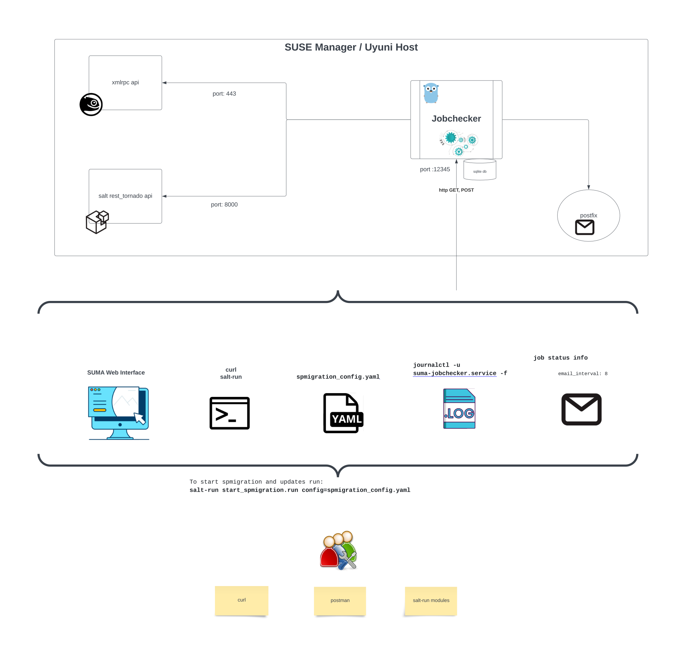

# SUSE Manager - jobchecker

This is a jobchecker with automated Updates and Service Pack Migration capabilities for Uyuni / SUSE Manager written in go.



## Pre-requisites:
* SUSE Manager / Uyuni v.4.3.7 or higher
* Salt-master running on SLES 15SP4 or higher

## Features:
* api endpoint - monitor SUSE Manager scheduled jobs, upon completion email notification will be sent.
* api endpoint - one can make HTTPS POST to the api to delete a system from SUSE Manager.
* health check - the program periodically makes SUSE Manager HTTP GET request to make health check.
* api endpoint - product migration - Upgrade systems within given groups in SUSE Manager to a defined service pack.
* email notifications - send job results to predefined list of recipients.
* api endpoint - salt states, grains execution for pre and post tasks
* api endpoint - trigger package updates including service pack migration for groups in SUSE Manager/Uyuni.

## Package Updates and Service Pack Migration
The jobchecker can trigger package updates including service pack migration for given groups in SUSE Manager/Uyuni.
Read here for [more details](./pkg_updates/README.md)


## systemd service for jobchecker
Jobchecker runs as a systemd service. [jobchecker.service](./etc/systemd/system/jobchecker.service)

The suma-jobchecker runs non-stop. Upone received HTTP requests it will processes the requests in sub-routines concurrently.
If no any job is in the queue then only health check is running every 10 seconds.


Inside the service file, you need to
* change the path to the binary and the path to the config file.
* change the Enrivonment variable SUMAKEY to your own key. This key is used to decrypt and encrypt the password value in the SUSE Manager configuration file.
* change the path of templates to your own path. Examples: [templates](./templates)
* change the interval to your own interval.

## Password encryption
SUSE Manager configuration file:
The password is encrypted with the key (SUMAKEY) provided in the systemd service file. The key is used to decrypt the password value.

To encrypt the password, you can use the following command:
https://github.com/bjin01/salt-sap-patching/blob/master/encrypt.py

```
python3.6 encrypt.py <YOUR-PASSWD>
```
Output:
```
Randomly generated key! Keep it safely!: 
taZk-X-MRuUSB-xYAzPys41Hi0X1iFDf0wBWynLTodw=

Save this encrypted password in your configuration file.
gAAAAABlGn1RxFaE9rRVJqVRehxTIJ6sPxPSSFuEvW4GGzmEXpT_b39D6yAQx5Us_FLLsthgUInR0UE0TPl79yf5Dsv-MNM0Bw==
```

With the encrypted password and the key, you can create the configuration file.
Example:

```
cat /etc/salt/master.d/suma.conf 
suma_api:
  suma1.bo2go.home:
    username: 'admin'
    password: gAAAAABj_xzeu23IpzKM-mYOYO
    email_to:
      - bo.jin@example.com
    healthcheck_interval: 10
    healthcheck_email:
      - bo.jin@example.com
```

## Delete a system from SUMA via jobchecker api
This is a HTTP POST request to the jobchecker api endpoint. The jobchecker will delete the system from SUSE Manager.
The authentication_token is the SUMAKEY defined in the systemd service file.
```
curl http://suma1.bo2go.home:12345/delete_system \
--data '{ \
  "minion_name": "pxesap02.bo2go.home", \
  "authentication_token": "e2J8anZ4G4n4IM=" \
}'
```
